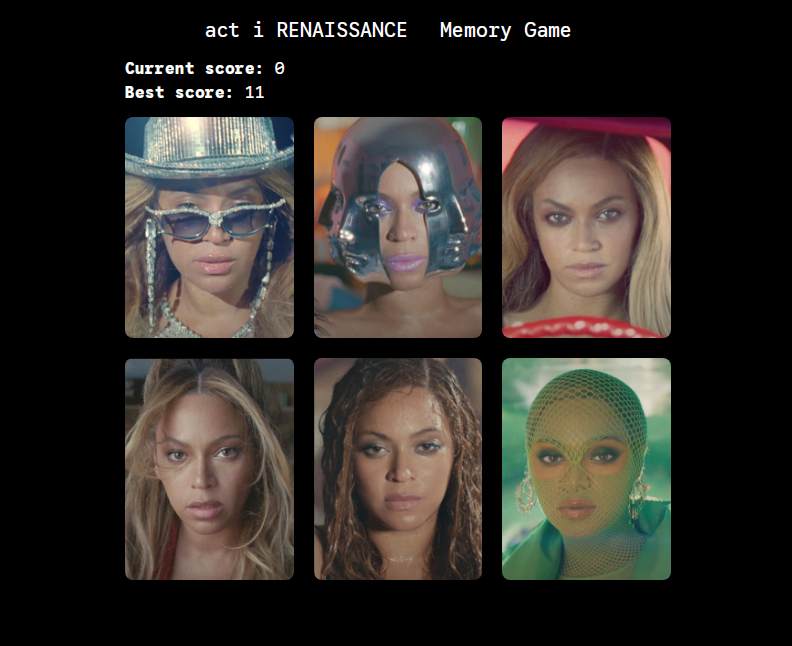

# Memory Card Game

This project is a Memory Card Game, created as part of The Odin Project curriculum. It's designed to practice and solidify React concepts, especially state management with hooks.

The application challenges the user to click on different images without selecting the same one twice. This version features a custom theme using Beyoncé images.

## Features

* Tracks your **Current Score** within a round.
* Saves your **Best Score** across multiple rounds.
* Shuffles the cards after every click to increase difficulty.
* Resets the game if you click the same card twice.

## Showcase



## Technologies Used

* React
* Vite
* Tailwind CSS

## Learning Journey

This project was an excellent opportunity to think critically about render behavior and state management in React.

A key challenge was deciding how to manage the card data array (which included the image links and a `clicked` status). The main dilemma was whether to use `useState` or `useRef`.

At first, `useState` seemed like the obvious choice. However, I realized that the component **was already re-rendering** every time the `currentScore` or `bestScore` (which are in state) were updated.

Ultimately, I decided to store the card array in a **`useRef`**. This decision was based on a few key insights:

1.  **Avoids Redundant Renders:** Since updating the score already causes a re-render, putting the card array in state would have caused an *additional*, unnecessary re-render every time a card's `clicked` status was modified.
2.  **Direct Access and Mutation:** `useRef` allowed me to directly access and modify the array (e.g., `ref.current[i].clicked = true`) without violating React's rules against direct state mutation. This provided a simpler, more direct way to update the card status.

This approach helped me understand the practical differences between `useState` and `useRef` and how to use `useRef` as a tool for persisting mutable data that doesn't, by itself, need to trigger a re-render.

Additionally, I learned to create a database to store the images on Supabase.

## Getting Started

To get a local copy up and running, follow these simple steps.

### Prerequisites

* npm
    ```sh
    npm install npm@latest -g
    ```

### Installation

1.  Clone the repo
    ```sh
    git clone [https://github.com/your_username/your_project.git](https://github.com/your_username/your_project.git)
    ```
2.  Install NPM packages
    ```sh
    npm install
    ```
3.  Run the development server
    ```sh
    npm run dev
    ```

## Live Demo

[[Link to live demo]]()